## Fever of Unknown Origin (FUO) {background-color="#9B0014"}

   

Prof. Russell E. Lewis   Department of Molecular Medicine   University of Padua

   russelledward.lewis\@unipd.it    https://github.com/Russlewisbo

  slides available at: www.padovaid.com

|  |  |
|------------------------------------|------------------------------------|
| {width="150"} | .svg){width="150"} |

## Objectives

 

-   Recognize leading infectious causes of FUO in key patient groups
-   Identify key fever patterns and clinical histories that may direct diagnosis
-   Differentiate FUO risks and possible spectrum of pathogens in immunocompromised hosts

::: notes
Today we'll explore the fascinating history of fever, understand the modern definition of FUO, review its epidemiology across different patient populations, and learn systematic approaches to diagnosis and management. We'll pay particular attention to how fever patterns can guide clinical thinking and how immunocompromised patients present unique diagnostic challenges.
:::

## The history of fever

 

::::: columns
::: {.column width="60%"}
-   **10th Century BCE Persian Physician Akhawayni** defined a system for fever curves in Hidāyat al-Muta'allimīn fī al-Tibb (The Student's Handbook of Medicine)
-   **Hippocratic physicians** proposed that body temperature, and physiologic harmony in general, involved a delicate balance among four corporal humors---blood, phlegm, black bile, and yellow bile.
    -   Fever was due to excess of yellow bile (many infections caused jaundice)
-   **Galen:** many types of fever developed from putrefaction of humors.
-   **Middle ages:** demonic possession
-   **18th century (Harvey's discovery of circulation)**- friction of blood flow through body causing fermentation and putrefaction in intestines
-   **Claude Bernard in the 19th century**- metabolic processes in the body
:::

::: {.column width="40%"}
   

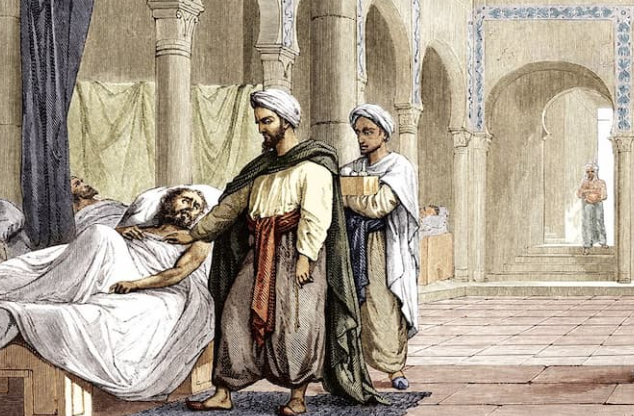{width="800"}
:::
:::::

::: notes
The history of fever reflects humanity's struggle to understand bodily temperature. From ancient humoral theory through Renaissance advances to modern medicine, our conceptualization has evolved from supernatural and chemical explanations to physiologic understanding.
:::

## Febris - Roman Goddess of Fever

{fig-align="center" width="400"}

The legend of Febris was said to center around the haunting marshes of Camagna in Southern Italy where like clockwork every year, the people would become deathly ill with a mysterious disease. She was so feared by the Romans that the suffering population had created a cult to Febris. They went so far as to wear protective amulets and build her temples in order to worship her to win her favour.

## Early thermometers

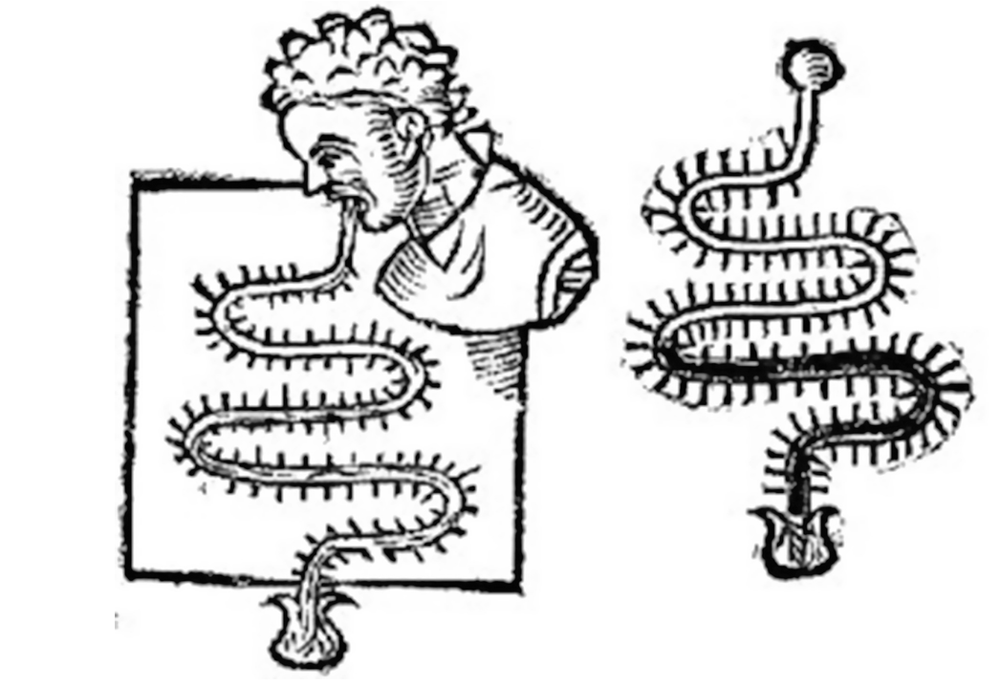{fig-align="center"}

A typical design of a thermoscope is a tube in which a liquid rises and falls as the temperature changes. The Sanctorius thermoscope. Professor Francis Ring, the University of Leeds

## Fever in modern medicine

 

::::: columns
::: {.column width="50%"}
-   Wunderlich's pioneering studies of thermometry reported normal temperature at 37°C

-   Since the 19th century, humans have become gradually colder - 0.05° to 0.5°C per decade!

    -   Current normal range is 36.3 to 36.5°C

-   Mackowiak (1992): mean oral temperature 36.8 ± 0.4°C; only 8% had 37°C

-   Fever now defined as: early-morning temperature ≥37.2°C or anytime ≥ 37.8°C
:::

::: {.column width="50%"}
{fig-align="center" width="600"}
:::
:::::

::: aside
[@mackowiak_worden94]
:::

## Physiologic variables affecting body temperature

 

-   **Age and sex differences**
    -   Women \~0.5°C higher at ovulation
    -   Infants have higher baseline temperatures
-   **Circadian rhythm**
    -   Zenith: late afternoon (peak)
    -   Nadir: early morning (trough)
-   **Other factors**
    -   Exercise and physical exertion
    -   Medications (antipyretics, corticosteroids)
    -   Digestion and recent meals
    -   Chronic disease and metabolic conditions

::: aside
Understanding normal temperature variation is crucial when evaluating a patient for FUO. A temperature of 37.5°C in a patient's early morning measurement may be pathologic, while 38.2°C in the evening may be within normal diurnal variation for that individual.
:::

## Thermal homeostasis

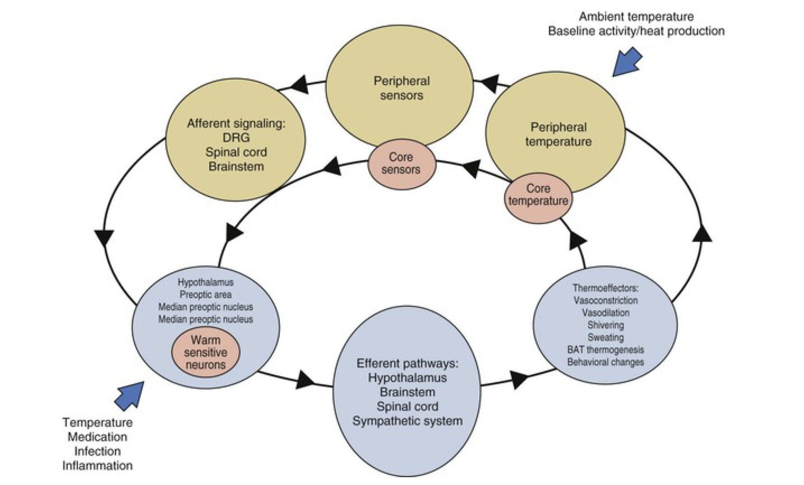{fig-align="center" width="1200"}

::: aside
The hypothalamus acts as the body's thermostat, continuously comparing core temperature against a defended setpoint (\~37°C). Afferent thermal signals arrive from both peripheral cutaneous receptors and central thermosensors in the preoptic area of the anterior hypothalamus. When core temperature fa of bodylls below the setpoint, efferent pathways activate heat-conserving and heat-generating responses: cutaneous vasoconstriction reduces radiative heat loss, and shivering thermogenesis in skeletal muscle increases metabolic heat production. When temperature exceeds the setpoint, the balance shifts to heat dissipation: cutaneous vasodilation increases convective and radiative losses, and eccrine sweating provides evaporative cooling. Understanding this tightly regulated system is essential for interpreting fever: a true febrile response represents a deliberate upward resetting of this setpoint by pyrogenic mediators—not a failure of thermoregulation. [@sajadimohammadm__mackowiakphilipa_]
:::

## Diurinal pattern of body temperature

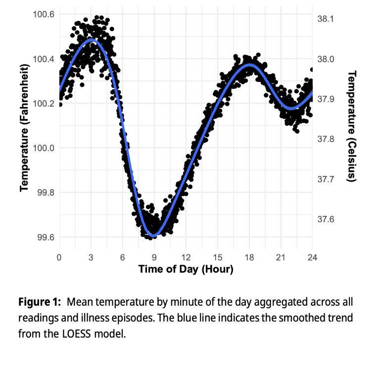{fig-align="center"}

## Fever vs. Hyperthermia {.smaller}

   

::: {.content-visible when-format="revealjs"}
| Feature | Fever | Hyperthermia |
|------------------------|------------------------|------------------------|
| **Set point** | Elevated | Normal |
| **Mechanism** | Regulated response | Unregulated heat generation |
| **Cause** | Pyrogens (LPS, IL-1, TNF) | Heat exposure, drugs, malignant hyperthermia |
| **Pathophysiology** | Altered hypothalamic setpoint | Failure of heat dissipation |
| **Sweating** | Absent initially (shivering);  later excessive | May be absent |
| **Treatment response** | Antipyretics effective | Antipyretics ineffective; cooling required |
| **Examples** | Infection, NIID, malignancy | Heat stroke, neuroleptic malignant syndrome |
:::

::: notes
This distinction is critical clinically. A patient with heat stroke will not respond to antipyretics because the problem is not a resetting of the hypothalamic setpoint, but rather failure of thermoregulation itself. Conversely, fever in infection responds to antipyretics because the elevated temperature is the body's intentional response to pathogens.
:::

## Infection-associated fever - The febrile response

 

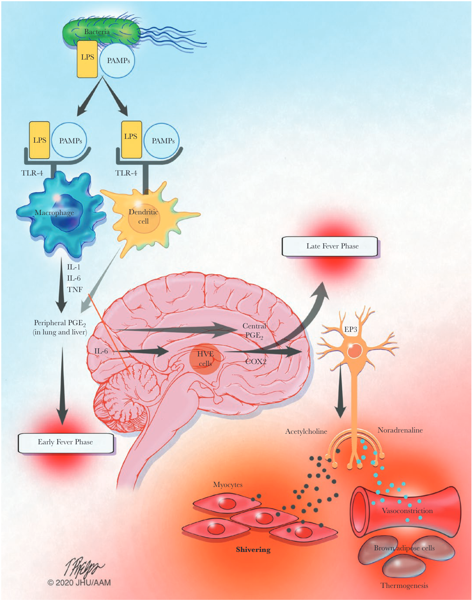{fig-align="center" width="600"}

::: aside
[@wright_auwaerter20]
:::

::: notes
When pathogens are recognized by the innate immune system, LPS from gram-negative bacteria and other PAMPs activate macrophages to release pyrogenic cytokines IL-1, TNF-α, and IL-6. These circulate to the hypothalamus, where they stimulate production of PGE₂ in the preoptic area (POA), which directly resets the thermoregulatory setpoint upward. The anterior hypothalamus then interprets the new setpoint as the desired temperature and initiates heat-generating mechanisms (shivering, vasoconstriction, behavior changes) until core temperature matches this new higher setpoint.
:::

## Sequelae of fever - Benefits of fever

 

-   **Phylogenetic conservation** suggests fever is beneficial - appears in ectotherms and endotherms
-   **Microbial metabolism** - most pathogenic bacteria are mesophiles (optimal growth at 35-37°C)
    -   Even modest temperature elevations slow replication
-   **Iron sequestration** - fever triggers hepatic synthesis of hepcidin and lactoferrin
    -   Sequesters free iron necessary for bacterial replication
-   **Enhanced immune function**
    -   Increased neutrophil migration
    -   Augmented antibody production
    -   Enhanced T-cell proliferation

::: aside
Rather than viewing fever as purely pathologic, modern immunology reveals it as an important component of the inflammatory response to infection. This is why antipyretics in certain infections (like pneumococcal pneumonia) may actually worsen outcomes.
:::

## Acute phase proteins {.smaller}

   

| Category | Proteins |
|------------------------------------|------------------------------------|
| **↑ Complement system** | C3, C4, C9, Factor B, C1 inhibitor, C4b-binding protein, Mannose-binding lectin |
| **↑ Coagulation / fibrinolysis** | Fibrinogen, Plasminogen, tPA, Urokinase, Protein S, Vitronectin, PAI-1 |
| **↑ Antiproteases** | α₁-Protease inhibitor, α₁-Antichymotrypsin, Pancreatic trypsin inhibitor, Inter-α-trypsin inhibitors |
| **↑ Transport proteins** | Ceruloplasmin, Haptoglobin, Hemopexin |
| **↑ Inflammatory mediators** | Secreted PLA₂, LPS-binding protein, IL-1 receptor antagonist, G-CSF |
| **↑ Others** | CRP, Serum amyloid A, α₁-Acid glycoprotein, Fibronectin, Ferritin, Angiotensinogen |
| **↓ Negative acute-phase** | Albumin, Transferrin, Transthyretin, α₂-HS glycoprotein, Alpha-fetoprotein, Thyroxine-binding globulin, IGF-I, Factor XII |

::: aside
[@gabay_kushner99]
:::

## Acute phase phenomena {.smaller}

   

| Category | Phenomena |
|------------------------------------|------------------------------------|
| **Neuroendocrine** | Fever, somnolence, anorexia; ↑ CRH, corticotropin & cortisol; ↑ arginine vasopressin; ↓ IGF-I; ↑ adrenal catecholamines |
| **Hematopoietic** | Anemia of chronic disease; leukocytosis; thrombocytosis |
| **Metabolic** | Muscle loss & negative nitrogen balance; ↓ gluconeogenesis; osteoporosis; ↑ hepatic lipogenesis; ↑ adipose lipolysis; ↓ lipoprotein lipase activity; cachexia |
| **Hepatic** | ↑ Metallothionein, iNOS, heme oxygenase, MnSOD, TIMP-1; ↓ phosphoenolpyruvate carboxykinase activity |
| **Nonprotein plasma** | Hypozincemia, hypoferremia, hypercupremia; ↑ plasma retinol & glutathione |

::: aside
[@gabay_kushner99]
:::

::: notes
The acute phase response is orchestrated by IL-1, IL-6, and TNF-α. The dramatic rise in inflammatory markers like ESR and CRP, along with changes in protein synthesis (increased fibrinogen, ceruloplasmin; decreased albumin), reflects the body's comprehensive metabolic mobilization against infection or inflammation.
:::

## Epidemiology of FUO - Definitions {.smaller}

| Category | Key causes / definition |
|------------------------------------|------------------------------------|
| **Classic FUO** | Infection (TB, endocarditis, occult abscess, zoonoses, enteric fever, syphilis, histoplasmosis), malignancy, autoimmune/autoinflammatory, miscellaneous; includes virally suppressed HIV (CD4 \>200) |
| **Nosocomial FUO** | FUO arising in hospitalized patients |
|  ICU | Bacteremia, pneumonia, *C. difficile*, fungemia, catheter infections, PE, acalculous cholecystitis, drug fever, stroke/intracranial hemorrhage |
|  Non-ICU | Similar to ICU causes; patient not critically ill |
| **Immunodeficiency-associated FUO** | Highly variable; depends on type and degree of immunodeficiency |
|  Organ-transplant recipients | Viruses, donor-derived infections, *Strongyloides* hyperinfection, opportunistic fungi, rejection, GVHD, HLH, ureaplasma hyperammonemia |
|  Neutropenia | Febrile \>5 days despite empirical antibiotics; influenced by neutropenia duration, GVHD prophylaxis, antimicrobial agents |
|  HCT recipients | Pre-engraftment: neutropenic causes; early post-engraftment: herpesvirus, adenovirus, hyperacute GVHD, pneumonia; late: relapsed cancer, immune reconstitution |
|  HIV/AIDS (no ART) | Acute retroviral syndrome, mycobacteria, endemic mycoses, toxoplasmosis, cryptococcosis, HHV-8–associated diseases, lymphoma |
| **Travel-associated FUO** | Malaria, enteric fever, leptospirosis, viral hemorrhagic fevers, typhus, undifferentiated tropical febrile illness |

::: aside
[@haidar_singh22]
:::

::: aside
Different definitions exist for FUO depending on clinical context. The classic definition applies to outpatient or minimally hospitalized patients with prolonged fever. The newer categories - nosocomial, neutropenic, and HIV-associated FUO - reflect that different populations have different diagnostic considerations and thresholds for investigation.
:::

## Fever therapy to treat syphilis

::::: columns
::: {.column width="50%"}
   

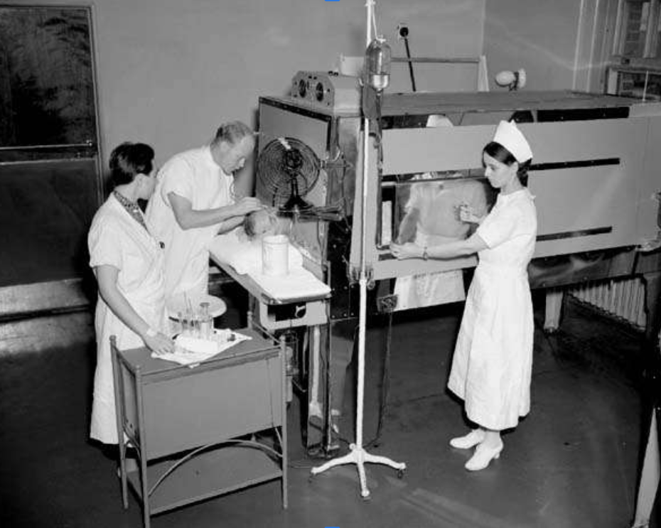
:::

::: {.column width="50%"}
-   Treponema pallidum is uniquely sensitive to increased temperatures

-   Using effective anti-malarial drugs to control the P. vivax infection, while maintaining the fever it causes to the detriment of other, ongoing, and then-incurable infections present in the patient, such as late-stage syphilis

-   Treponema pallidum is uniquely sensitive to increased temperatures

-   Using effective anti-malarial drugs to control the P. vivax infection, while maintaining the fever it causes to the detriment of other, ongoing, and then-incurable infections present in the patient, such as late-stage syphilis

-   This type of pyrotherapy was most famously used by psychiatrist [Julius Wagner-Jauregg](https://en.wikipedia.org/wiki/Julius_Wagner-Jauregg), who won the Nobel Prize for Medicine in 1927 for his elaboration of the procedure in treating neurosyphilis
:::
:::::

## Classic FUO

 

-   **Definition:**
    -   Temperature of \> 38.3°C \> 3 weeks
    -   Fever \>2 separate outpatient visits with diagnostic investigations *or*
    -   Fever \>2 visits in hospital of 3 days with diagnostic investigations
        -   *However*,... these definitions are largely subjective
-   **Leading causes:**
    -   Infections (geography dependent)
    -   Inflammatory conditions (age dependent)
    -   Cancer (age dependent)
    -   Undiagnosed/unknown

## Frequency of the 5 main etiologic categories of FUO

Infectious causes decrease in patients above age 65 years

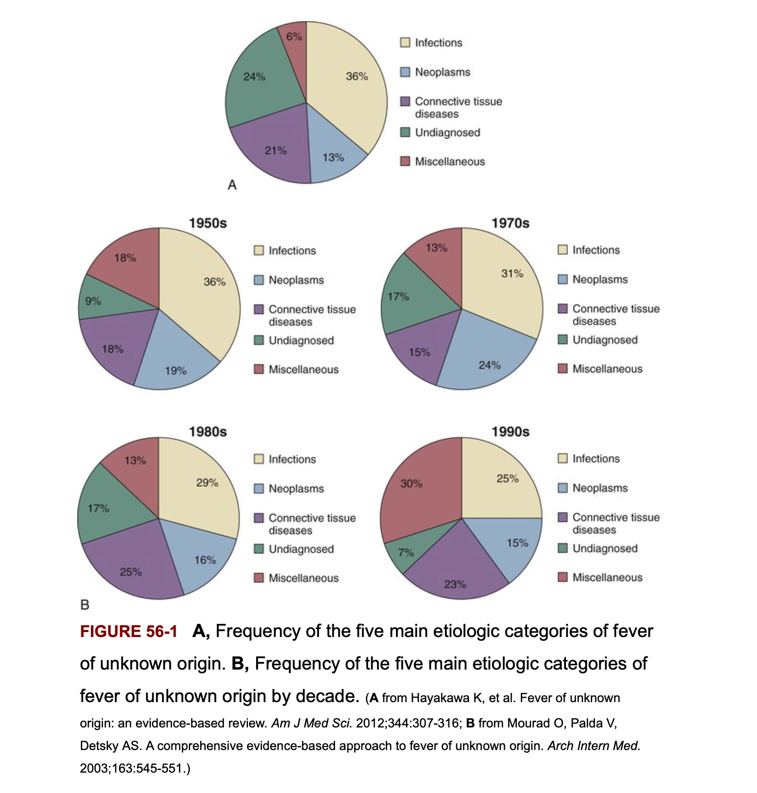{fig-align="center" width="1200"}

## Classic FUO - Infectious Etiology

 

-   **Chronic or relapsing infections**
    -   Occult abscess (intra-abdominal, hepatic, splenic, renal, perirectal)
    -   Endocarditis (both native and prosthetic valve)
    -   Tuberculosis (pulmonary and extrapulmonary)
    -   Complicated urinary tract infections (pyelonephritis, prostatitis)
    -   Osteomyelitis (especially vertebral)
    -   Other: brucellosis, leptospirosis, syphilis, bartonellosis

## Rare and miscellaneous causes of fever {.smaller}

   

| Category | Examples |
|------------------------------------|------------------------------------|
| **Autoinflammatory / periodic fevers** | Adult-onset Still's disease, Behçet's syndrome, Familial Mediterranean fever, Familial Hibernian fever, Periodic fever, Schnitzler's syndrome |
| **Vascular / cardiac** | Aortic dissection, Aortitis, Atrial myxoma, Giant coronary aneurysm, Pericarditis, Postpericardiotomy syndrome, Polyarteritis nodosa, Pulmonary emboli, Veno-occlusive disease |
| **Hematologic / oncologic** | Castleman's disease, Cyclic neutropenia, Hemoglobinopathies, Hemolytic anemias, Hemophagocytic syndrome, Histiocytosis X, Immunoblastic lymphadenopathy, Lymphomatoid granulomatosis, Myeloproliferative syndromes, Paroxysmal hemoglobinurias, Rosai-Dorfman disease, TTP |
| **Granulomatous / lymphoproliferative** | Allergic alveolitis, Granulomatous hepatitis, Granulomatous peritonitis, Kikuchi-Fujimoto disease, Lofgren syndrome, Retroperitoneal fibrosis, Sarcoidosis, Subacute necrotizing lymphadenitis |
| **Autoimmune / rheumatologic** | Autoimmune cholangitis, Erythema multiforme, Inflammatory bowel disease, Serum sickness, Sjögren's syndrome, Wegener's granulomatosis |
| **Endocrine / metabolic** | Addison's disease, Fabry's disease, Parathyroid apoplexy, Pheochromocytoma, Thyroiditis & thyrotoxicosis, Vitamin B₁₂ deficiency |
| **GI / hepatic** | Alcoholic hepatitis, Cirrhotic fever, Pancreatitis |
| **Infectious** | Bartonellosis, Carcinomatous meningitis, Chronic meningitis, Hantavirus, Human picornavirus, Hypereosinophilic syndrome, Infected urachal cyst, Sinusitis, Whipple's disease |
| **Other** | Drug fever & hypersensitivities, Factitious fever, Metal fume fever, Resorbing hematoma |

## Uncommon and rare causes of FUO {.smaller}

   

| Category | Examples |
|------------------------------------|------------------------------------|
| **Infections** | Bartonellosis, hantavirus, coccidioidomycosis, histoplasmosis, blastomycosis, cysticercosis |
| **NIID** | Addison disease, Behçet syndrome, SLE, vasculitis, inflammatory bowel disease, GPA, sarcoidosis, Sjögren syndrome, thyroiditis, adult-onset Still disease |
| **Malignancy** | Atrial myxoma, lymphoma, leukemia, pheochromocytoma, Schnitzler syndrome |
| **Other** | Cirrhotic fever, drug fever, factitious fever, vitamin B₁₂ deficiency, pulmonary embolism |

::: notes
This table emphasizes that the differential for FUO is vast. The key to narrowing the differential is careful history-taking, physical examination, and judicious use of targeted investigations rather than indiscriminate laboratory testing.
:::

## Classic FUO in infants and children

 

::::: columns
::: {.column width="50%"}
-   **Respiratory tract infections** - viral, atypical organisms
-   **Other infections:**
    -   UTIs (especially important in young girls)
    -   Brucellosis, tuberculosis, bartonellosis
-   **Systemic inflammatory conditions:**
    -   Kawasaki disease (critical, age \< 5 years)
    -   Inflammatory bowel diseases
    -   Still's disease (juvenile rheumatoid arthritis)
-   **Note:** Connective tissue diseases and cancers are generally rare in children
-   **Important:** Joint involvement is a sign of serious disorder - consider endocarditis, leukemia, connective tissue disease
:::

::: {.column width="50%"}
{width="600"}
:::
:::::

## Classic FUO in elderly patients

 

::::: columns
::: {.column width="50%"}
-   **In developed countries: connective tissue diseases \> infections**
    -   Temporal arteritis (critical diagnosis - risk of blindness)
    -   Polymyalgia rheumatica
    -   Other vasculitides
-   **Diagnostic challenge:** symptoms are subacute and non-specific, easily attributed to aging
-   **Infections still important:**
    -   Intra-abdominal abscess
    -   Complicated UTIs (often without pyuria)
    -   Tuberculosis (may be reactivation)
    -   Endocarditis (prosthetic valves more common in elderly)
-   **Malignancy:** solid tumors and hematologic malignancies increase with age
:::

::: {.column width="50%"}

:::
:::::

::: notes
The elderly warrant special mention because temporal arteritis is a medical emergency masquerading as FUO. An elevated ESR alone is not sufficient - clinical suspicion and a low threshold for temporal artery biopsy can be vision-saving.
:::

## Returning travelers {.smaller}

 

| Diagnosis | Maclean et al (*n* = 587) | Doherty et al (*n* = 195) |
|----|:--:|:--:|
| Malaria | 32% | 42% |
| Respiratory tract infection | 11% | 2.6% |
| Dysentery | 4.5% | 5.1% |
| Urinary tract infection / pyelonephritis | 4% | 2.6% |
| Dengue fever | 2% | 6.2% |
| Enteric fever | 2% | 1.5% |
| Hepatitis | 6% | 3% |
| Tuberculosis | 1% | 2% |
| Rickettsial infection | 1% | 0.5% |
| Amebic liver abscess | 1% | 0% |
| Acute HIV infection | 0.3% | 1% |
| Other miscellaneous infections | 4.3% | 9.2% |
| Miscellaneous noninfectious causes | 6% | 1% |
| **Undiagnosed** | **25%** | **24.6%** |

::: aside
In the returning traveller with FUO, the incubation period and geographic exposures are paramount. Malaria, dengue, typhoid, leptospirosis, and rickettsial infections should be high on the differential based on travel history and season. Serologic testing and blood cultures are essential early investigations [@wrightwilliamf__mackowiakphilipa_15].
:::

## Nosocomial (Health-Care Associated) FUO

 

-   **Leading causes:**
    -   Drug fever (especially to antibiotics, anti-epileptic medications)
    -   Post-operative complications (e.g., occult abscess, anastomotic leak)
    -   Decubitus ulcers with superimposed infection
    -   Septic thrombophlebitis (peripherally inserted central catheters)
    -   Recurrent pulmonary emboli
    -   Myocardial infarction
    -   Hematologic malignancy (newly diagnosed during hospitalization)
    -   Blood transfusion reaction
    -   Reactions to contrast media used in radiologic procedures
    -   *Clostridium difficile* colitis

## Fever in post-operative patients

 

::::: columns
::: {.column width="50%"}
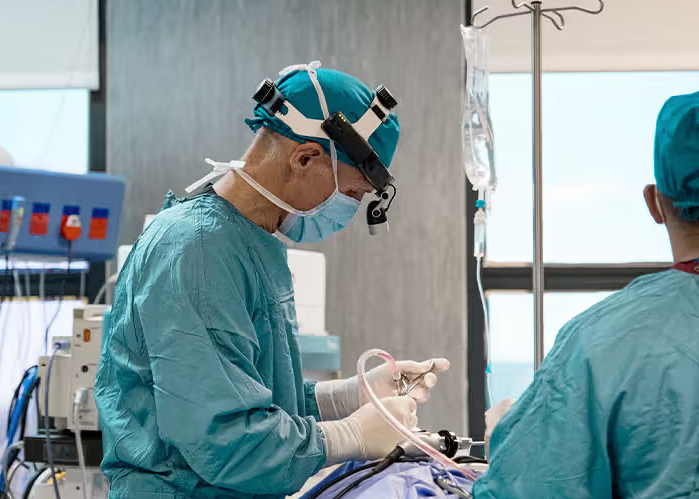
:::

::: {.column width="50%"}
-   **Epidemiology:** \> 1/3 of patients manifest fever in first 5 days post-surgery
-   **Infectious vs. non-infectious:** \< 10% of febrile patients have an identified source or positive cultures
-   **Pathophysiology:** Fever may represent a physiological response to surgically-induced tissue injury
    -   Release of pyrogenic cytokines and interleukins
    -   Not necessarily indicative of infection
-   **Clinical pearl:** Early fever (post-op day 1-3) is usually non-infectious; later fever (day 5+) warrants infection investigation
:::
:::::

## FUO in ICU patients

 

::::: columns
::: {.column width="50%"}
-   **Early fevers are common** and often non-infectious
    -   Associated with good prognosis
    -   Related to inflammatory response to critical illness
-   **Prolonged fever carries a poorer prognosis**
-   **Common complications:**
    -   Sinusitis (from mechanical ventilation, supine positioning, feeding tubes)
    -   Ventilator-associated pneumonia
    -   Catheter-related bloodstream infections
-   **Other causes similar to nosocomial FUO**
    -   Abscess, drug fever, septic thrombophlebitis, pulmonary emboli
:::

::: {.column width="50%"}
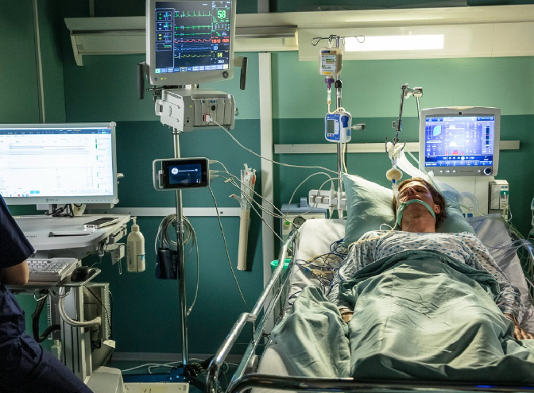
:::
:::::

## FUO in stroke patients

 

::::: columns
::: {.column width="50%"}
-   **Non-infective fevers are common** in stroke patients
    -   Occur earlier after stroke than infection
    -   Related to hypothalamic injury and cytokine release
-   **Infection-related complications:**
    -   UTI (from urinary catheterization)
    -   Aspiration pneumonia
    -   DVT/PE
-   **Clinical challenge:** Distinguishing fever from infarct-related inflammation vs. infection can be difficult; broad-spectrum antibiotics often given empirically
:::

::: {.column width="50%"}
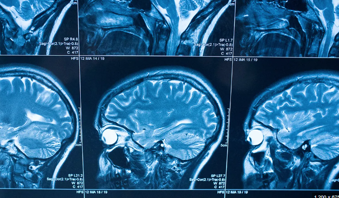
:::
:::::

## FUO in neutropenic patients

-   **ANC = Total WBC x (% Segs + % Bands)**

-   **Definition of neutropenia:**

    -   ANC \< 500 cells/mm³
    -   "Profound" neutropenia: ANC \< 100 cells/mm³

-   **Frequency of fever during chemotherapy-induced neutropenia:**

    -   10-50% of patients with solid tumors
    -   80% of those with hematologic malignancies during ≥1 chemotherapy cycle
    -   Most patients will have NO infectious etiology documented

-   **Critical finding:** Signs of inflammation are notoriously absent other than fever

    -   No exudate, no fluctuance, no purulent drainage
    -   Makes clinical diagnosis extremely difficult

::: aside
This is one of the most challenging patient populations. The absence of typical signs of infection makes physical examination nearly useless, and a single positive blood culture in a neutropenic patient must be treated as bacteremia until proven otherwise. Prompt empiric broad-spectrum antibiotics (before cultures return) are standard of care.
:::

## Clinical manifestations of infection related to absolute neutrophil count

 

| Sign/Symptom        | Type of Infection | \% with ANC\<100 | \% with ANC\>1000 |
|-------------------|------------------|------------------|------------------|
| **Fever**           | Overall           | 98               | 76                |
| **Bacteremia**      | Overall           | 43               | 13                |
| **Fluctuance**      | Anorectal         | 8                | 67                |
| **Exudate**         | Skin              | 5                | 92                |
| **Purulent sputum** | Pneumonia         | 8                | 84                |
| **Pyuria**          | UTI               | 11               | 97                |

 

::: aside
[@sickles_etal75]
:::

::: aside
This table powerfully illustrates why clinical signs fail in severe neutropenia. A profoundly neutropenic patient with anorectal infection has only 8% chance of fluctuance - the classic finding that would alert us to a perirectal abscess. Yet such abscesses are common sources of bacteremia in this population.
:::

## Possible causes of fever in neutropenic patients not responding to broad-spectrum antibiotics {.smaller}

 

| Cause | Approx. frequency in high-risk patients |
|------------------------------------|:----------------------------------:|
| Fungal infections susceptible to empirical therapy | 40% |
| Bacterial infections (cryptic foci, biofilms, resistant organisms) | 10% |
| GVHD after hematopoietic stem cell transplantation | 10% |
| Fungal infections resistant to empirical antifungal therapy | 5% |
| *Toxoplasma gondii*, mycobacteria, or fastidious pathogens (*Legionella*, *Mycoplasma*, *Chlamydia pneumoniae*, *Bartonella*) | 5% |
| Viral infections (herpesviruses, CMV, EBV, HHV-6, VZV, HSV, parainfluenza, RSV, influenza) | 5% |
| **Undefined** (drug fever, chemotherapy toxicity, antitumor responses, undefined pathogens) | **25%** |

::: aside
[@corey_boeckh02]
:::

::: notes
When neutropenic patients fail to defervescence on appropriate empiric antibiotics, fungal infection (especially invasive aspergillosis) and CMV must move high on the differential. Invasive fungal infection carries mortality rates exceeding 50% even with treatment if there is significant delay in diagnosis.
:::

## Cell-mediated immunity - Th1 pathway

 

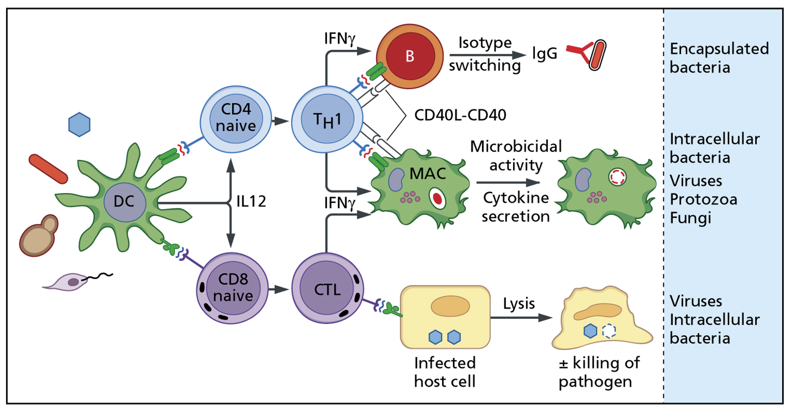{fig-align="center" width="1200"}

::: aside
[@playfairj__bancroftg_13]
:::

## Cell-mediated immunity - Th2 pathway

 

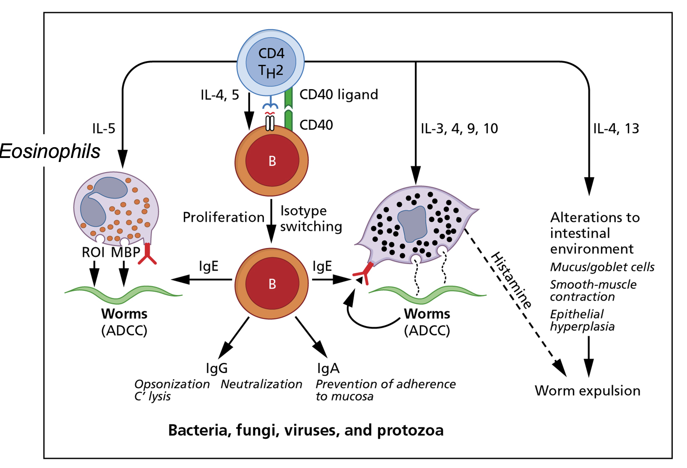{fig-align="center" width="1200"}

::: aside
[@playfairj__bancroftg_13]
:::

## Cell-mediated immunity -   Drug allergy (Type IV hypersensitivity)

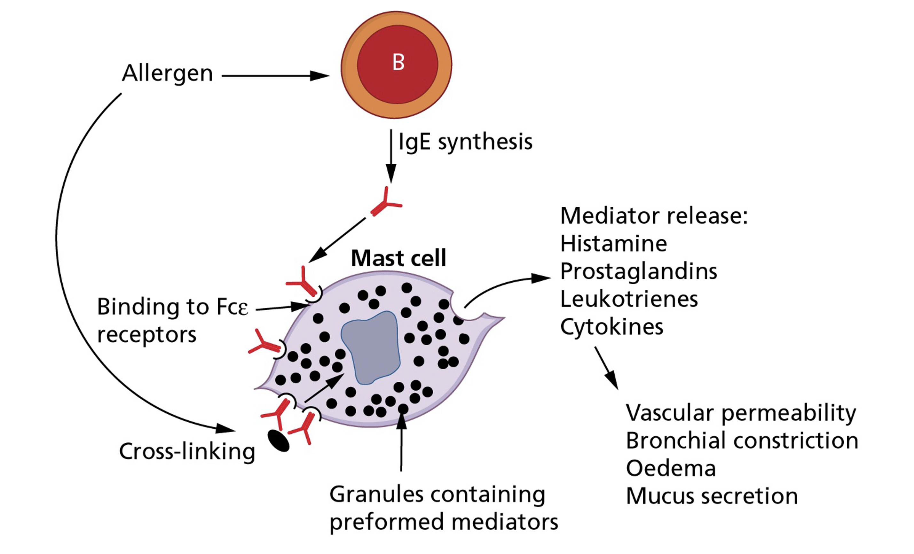{fig-align="center" width="1200"}

::: aside
[@playfairj__bancroftg_13]
:::

::: notes
Drug fever is a type IV hypersensitivity reaction mediated by T cells. It typically appears 1-3 weeks after starting a medication and resolves within 48-72 hours of drug discontinuation. Antibiotics are the most common culprits, but NSAIDs, anticonvulsants, and many other drugs can cause fever. The diagnosis is clinical - there are no specific tests, but re-challenge with the drug should reproduce the fever (though this is rarely done in practice).
:::

## Infections in immunocompromised hosts

 

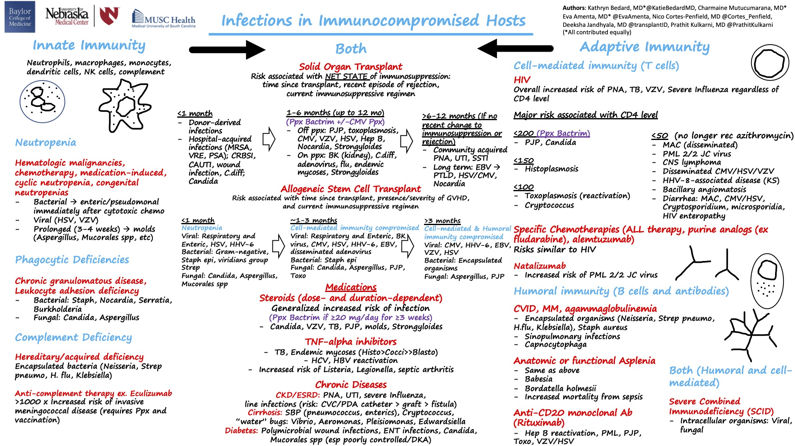{fig-align="center"}

::: notes
The degree and type of immunosuppression determines which infections are most likely. CD4 count \<200 in HIV predisposes to PCP and toxoplasmosis. Neutropenia predisposes to bacterial and fungal infections. T-cell defects (from chemotherapy, calcineurin inhibitors) predispose to opportunistic infections like CMV and fungal infections. Understanding the specific immune defect is critical for generating an appropriate differential diagnosis.
:::

## HIV-related FUO

 

-   **Primary infection phase** characterized by mononucleosis-like illness
    -   Fever is common
    -   May be undiagnosed if it precedes seroconversion (acute retroviral syndrome)
-   **Later phases of untreated HIV**
    -   Episodes of fever become common
    -   Often signify superimposed illness - e.g., opportunistic infections
    -   Infections may manifest atypically
-   **HAART era impact**
    -   Once highly-active antiretroviral therapy (HAART) is started
    -   Effective suppression of HIV viral load
    -   Frequency of FUO falls markedly
    -   CD4 recovery allows control of opportunistic infections

## Etiology of fever in HIV-Associated FUO (n=70) {.smaller}

| Etiology                            |   No. (%)    |
|-------------------------------------|:------------:|
| **Infection**                       | **63 (88%)** |
|  DMAC                               |   22 (31%)   |
|  *Pneumocystis jirovecii* pneumonia |   10 (13%)   |
|  CMV                                |   8 (11%)    |
|  Histoplasmosis                     |    5 (7%)    |
|  Viral (not CMV)                    |    5 (7%)    |
|  Bacterial                          |    4 (5%)    |
|  *Mycobacterium tuberculosis*       |    4 (5%)    |
|  Fungal (not histoplasmosis)        |    2 (3%)    |
|  Parasitic                          |    2 (3%)    |
|  *Mycobacterium genavense*          |    1 (1%)    |
| **Neoplasia**                       |  **6 (8%)**  |
|  Lymphoma                           |    5 (7%)    |
|  Kaposi sarcoma                     |    1 (1%)    |
| **Miscellaneous**                   |  **3 (4%)**  |
|  Drug fever                         |    2 (3%)    |
|  Castleman disease                  |    1 (1%)    |

::: aside
[@wrightwilliamf__mackowiakphilipa_15]
:::

## Naproxen (NSAID) fever suppression test for "tumor fever"

 

-   **Indications for trial:**
    -   Temperature \> 37.8°C at least once daily for ≥2 weeks
    -   Lack of evidence of infection (physical exam, labs, imaging)
    -   Absence of drug fever, transfusion reaction, or allergic mechanisms
    -   Lack of response to ≥7 days of empiric antibiotics
-   **Procedure:**
    -   Naproxen 500 mg BID × 3-5 days
-   **Positive result:**
    -   Prompt complete defervescence (lysis of fever)
    -   Sustained normal temperature while receiving naproxen
    -   Fever recurrence when drug discontinued
-   **Note:** Not universally accepted; sensitivity/specificity debated

## Diagnosis of FUO {background-image="/images/thermometer.jpg"}

## General diagnostic evaluation of FUO {.smaller}

 

| Step | Investigation |
|------------------------------------|------------------------------------|
| **History & Exam** | Comprehensive history; repeated physical exams |
| **Laboratory** | CBC, comprehensive metabolic panel, urinalysis with microscopy |
| **Inflammatory Markers** | ESR, C-reactive protein |
| **Autoimmune Screening** | ANA, rheumatoid factor |
| **Imaging - First Line** | Chest radiograph, CT abdomen/pelvis |
| **Cultures** | Blood cultures (3 specimens without antimicrobials), urine culture |
| **Serologies** | CMV IgM/PCR, heterophil antibody (EBV) in young adults |
| **Tuberculosis** | Tuberculin skin test, interferon-gamma release assay |
| **Advanced Imaging** | MRI, PET-CT, duplex ultrasound lower extremities |
| **Invasive Procedures** | Biopsy (lymph node, liver, bone marrow) if indicated |

::: aside
The history and physical examination must guide which investigations to pursue, otherwise the patient will undergo excessive and often unnecessary testing with false positives leading to misdirected therapy.  [@wrightwilliamf__mackowiakphilipa_15]
:::

## Patient history

 

-   **Helps guide choice of initial laboratory investigations** - this is the most important step

-   **Travel history:** where, when, duration, exposures to animals, arthropod vectors, contaminated water

-   **Exposure to animals and work environment:** pet birds (psittacosis), cats (toxoplasmosis, bartonellosis), tick exposure (Lyme, Q fever)

-   **Recent contact with ill persons** or family history of FUO (e.g., familial Mediterranean fever)

-   **Complete medication list:** including OTC drugs, supplements, recent antimicrobials

-   **Prior history of FUO** - may be recurrence of same diagnosis

-   **Previously diagnosed conditions:** malignancy, rheumatic fever, valve disease that predisposes to endocarditis

::: notes
A 45-year-old history of fever in a farmer with exposure to birth products of cattle should immediately suggest Q fever. A history of fever in a Southwest US resident with respiratory symptoms should suggest coccidioidomycosis. The history is the most efficient diagnostic tool - proper use can narrow a vast differential to a manageable few diagnoses.
:::

## Verification of fever and pattern of fever

 

-   **Verification of fever:** Often overlooked step
    -   In some series, up to 30% referred for FUO where determined to NOT have fever
    -   Request fever log or have patient take temperatures at home
-   **Fever patterns** - use of patterns to narrow differential:
    -   *Continuous, remittent, intermittent, hectic (Charcot's), quotidian, quartan, biphasic (saddleback), Pel-Ebstein*
-   **Factors affecting fever pattern:**
    -   Hydration status, ambient temperature
    -   Accuracy of temperature measurements (different sites)
    -   Antipyretics and corticosteroids suppress fever
    -   Blood transfusions and other medical interventions

## Continuous sustained fever

 

::::: columns
::: {.column width="50%"}
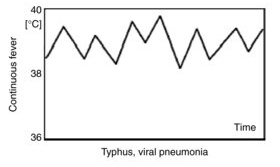{width="800"}
:::

::: {.column width="50%"}
-   Continuous fever with slight remission not exceeding 2°C

    -   Lobar and gram-negative pneumonia
    -   Rickettsiosis
    -   Typhoid fever
    -   CNS disorders
    -   Tularemia
    -   Falciparum (malignant tertian) malaria
:::
:::::

::: aside
[@mackowiak_etal97a]
:::

## Intermittent (quotidian) fever

 

::::: columns
::: {.column width="50%"}
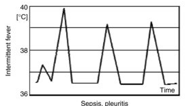{width="800"}
:::

::: {.column width="50%"}
-   Intermittent fever with wide fluctuations, usually normal or low in the morning and peaking between 4:00 and 8:00 PM
    -   Localized pyogenic infections and bacterial endocarditis with chills and leukocytosis
    -   Malaria may present with daily (quotidian), every 3rd day (tertian), or every 4th day (quartan) patterns
    -   Double quotidian pattern (two daily spikes) seen with:
        -   Salmonellosis
        -   Miliary tuberculosis
        -   Double malarial infections (\>1 species)
        -   Gonococcal and meningococcal endocarditis
:::
:::::

::: aside
[@mackowiak_etal97a]
:::

## Malaria fever - Paroxysmal patterns

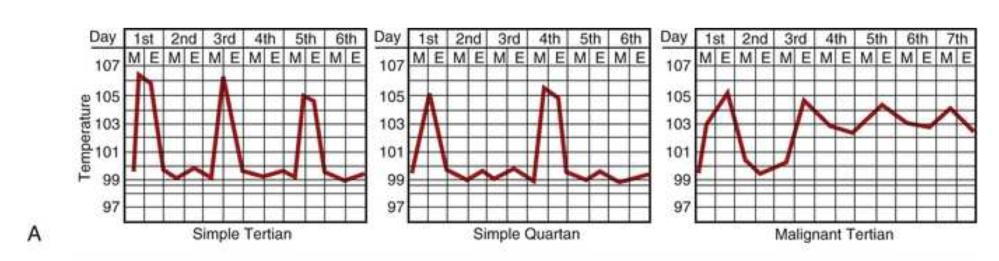{fig-align="center"}

Febrile paroxysms may occur every other day for *P. vivax*, *P. ovale*, and *P. falciparum* (tertian fever) and every third day for *P. malariae* (quartan fever).     Paroxysms occurring at regular intervals are more common in *P. vivax* or *P. ovale* than *P. falciparum*. With improvements in early diagnosis and treatment, this traditional description of cyclic fever is seen infrequently.

::: aside
The regular paroxysmal pattern of malaria fever historically served as a diagnostic clue, but modern rapid diagnostic tests have made fever pattern analysis less clinically relevant. Still, recognizing the tertian and quartan patterns can be helpful in settings with limited diagnostic capacity.
:::

## Saddle-back (biphasic) fever

 

::::: columns
::: {.column width="50%"}
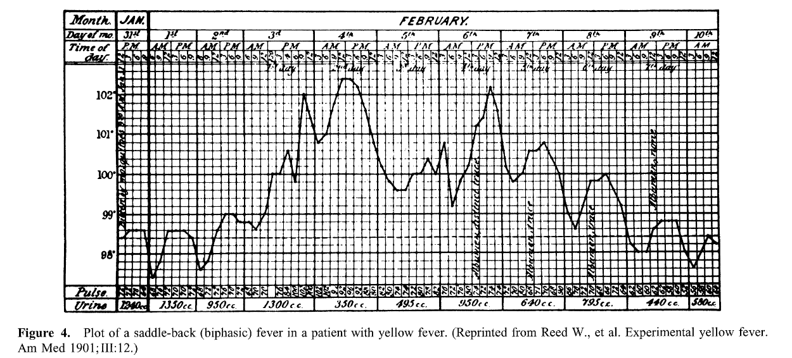{width="800"}

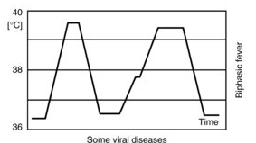{width="600"}
:::

::: {.column width="50%"}
-   Several days of fever, distinct reduction in fever for \~1 day, then several days of higher fever
    -   Dengue and yellow fever
    -   Colorado tick fever
    -   Rift valley fever
    -   Influenza and other viral infections
:::
:::::

::: aside
[@mackowiak_etal97a]
:::

## Intermittent hectic (Charcot's) fever

 

::::: columns
::: {.column width="50%"}
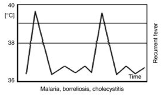{width="800"}
:::

::: {.column width="50%"}
-   Sporadic episodes of fever with periods of normal temperature and recurrence
    -   Frequently seen in cholangitis associated with cholelithiasis
    -   Classic teaching: jaundice, fever, right upper quadrant pain (Charcot's triad)
    -   Often associated with leukocytosis and toxic appearance
:::
:::::

::: aside
[@mackowiak_etal97a]
:::

## Undulating (Pel-Ebstein) fever

 

::::: columns
::: {.column width="50%"}
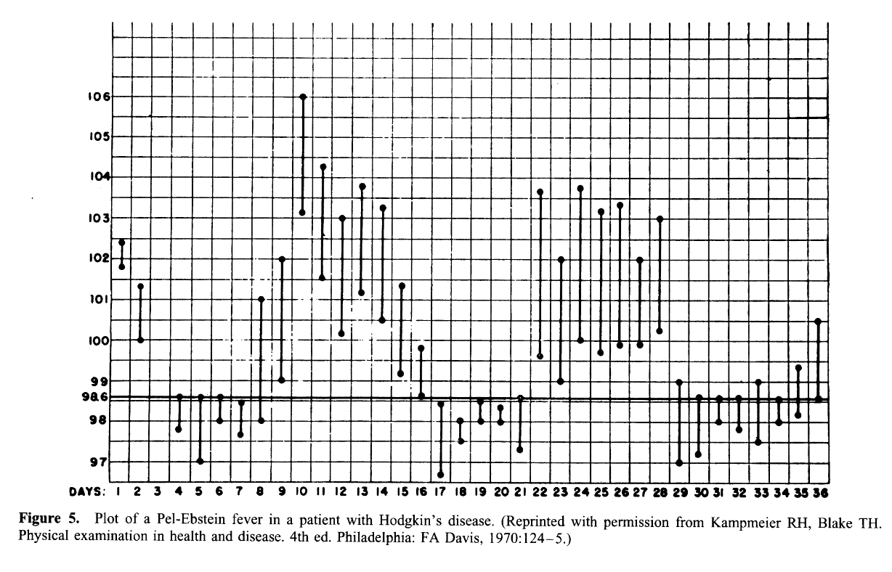{width="600"}

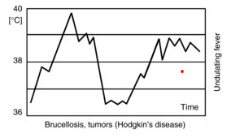{width="600"}
:::

::: {.column width="50%"}
-   Weekly or longer periods of fever and equally long afebrile periods, with repetition of the cycle
    -   Hodgkin's disease (classic association)
    -   Brucellosis due to *Brucella melitensis*
    -   Occasionally tuberculosis
:::
:::::

::: aside
[@mackowiak_etal97a]
:::

::: notes
While Pel-Ebstein fever was historically associated with Hodgkin lymphoma, modern cases are rarely encountered in developed countries due to earlier diagnosis. However, it remains a useful pattern to recognize in resource-limited settings where lymphoma diagnosis may be delayed.
:::

## *Typus Inversus*

 

::::: columns
::: {.column width="50%"}
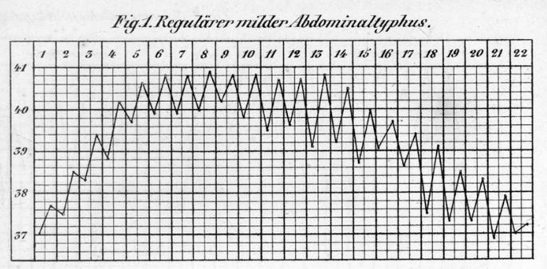
:::

::: {.column width="50%"}
-   Reversal of diurnal pattern with highest temperatures in early morning hours rather than late afternoon/evening
    -   Miliary TB
    -   Salmonelloses
    -   Hepatic abscess
    -   Bacterial endocarditis
:::
:::::

::: aside
*Typus inversus* is an unusual pattern but when present strongly suggests one of the listed diagnoses. Its presence should prompt investigation for disseminated TB or endocarditis.[@mackowiak_etal97a]
:::

::: aside
:::

## Typhoid fever - Step-ladder fever

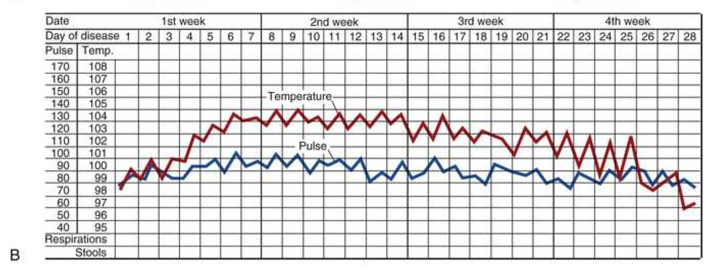{fig-align="center"}

::: aside
The classic teaching of typhoid's step-ladder fever (progressively higher fever each day for 3-4 days until reaching a plateau) is less commonly observed in modern cases, possibly due to partial treatment with antipyretics or other antimicrobials before diagnosis. However, when present, it is highly suggestive of enteric fever. **Note the relative bradycardia-a suggestive sign of Typhoid fever.**
:::

## Jarisch-Herxheimer reaction

::::: columns
::: {.column width="50%"}
-   **Definition:** Sharply increased elevation of temperature with rigors, chills, and constitutional symptoms occurring within hours of starting antibiotic therapy

-   **Mechanism:** Lysis of spirochetes (or other organisms) releases endotoxin triggering acute inflammatory response

-   **Organisms associated:**

    -   Primary or secondary syphilis
    -   Leptospirosis
    -   Tick-borne relapsing fever (*Borrelia*)
    -   Tetracycline or chloramphenicol therapy for acute brucellosis

-   **Clinical significance:** Can be severe enough to cause hemodynamic compromise; does not indicate treatment failure
:::

::: {.column width="50%"}
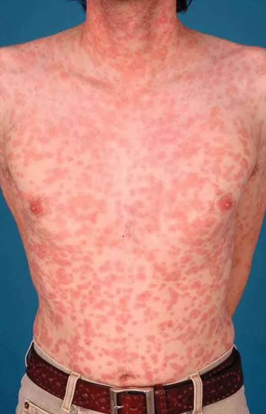{width="600"}
:::
:::::

::: notes
Recognizing the Jarisch-Herxheimer reaction prevents inappropriate termination of antibiotic therapy. Patients and clinicians should be counseled to expect transient clinical deterioration with initiation of treatment for spirochetal diseases.
:::

## Physical examination {.smaller}

 

-   Some signs are subtle and may require repeated exams to be appreciated
-   Vigorous search for lymphadenopathy (consideration for biopsy)
-   Careful examination of fundi, oropharynx, temporal arteries, abdomen, spleen, joints, skin, nails, genitalia

| Body site | Physical finding | Diagnosis |
|------------------------|------------------------|------------------------|
| Head | Sinus tenderness | Sinusitis |
| Temporal artery | Nodules, reduced pulsations | Temporal arteritis |
| Oropharynx | Ulceration; tender tooth | Disseminated histoplasmosis, periapical abscess |
| Fundi / conjunctivae | Choroid tubercle, petechiae, Roth's spot | Disseminated granulomatosis, endocarditis |
| Thyroid | Enlargement, tenderness | Thyroiditis |
| Heart | Murmur | Infective or marantic endocarditis |
| Abdomen | Enlarged iliac lymph nodes, splenomegaly | Lymphoma, endocarditis, disseminated granulomatosis |
| Rectum | Perirectal / prostatic fluctuance, tenderness | Abscess |
| Genitalia | Testicular nodule; epididymal nodule | Periarteritis nodosa; disseminated granulomatosis |
| Lower extremities | Deep venous tenderness | Thrombosis / thrombophlebitis |
| Skin and nails | Petechiae, splinter hemorrhages, subcutaneous nodules, clubbing | Vasculitis, endocarditis |

::: aside
[@wrightwilliamf__mackowiakphilipa_15]
:::

## Laboratory investigations

 

**"The cause of FUO is more frequently a *common disease* presenting in an *atypical fashion* than a *rare disease* presenting *in a typical fashion.*"**

   

-   Multiple diagnostic algorithms exist in literature

-   Must be selectively applied or will result in excessive unfocused diagnostic testing

    -   False positives lead to misdiagnosis
    -   Misguided treatment plans

-   **"Sutton's Law"** - pursue most likely diagnosis first based on history and epidemiology

-   History and physical exam (most important) should guide choice and sequence of tests

::: aside
Shotgun laboratory approach to FUO is expensive, time-consuming, and counterproductive. A focused history-driven approach is far more efficient. This principle of parsimony - explaining the patient's illness with the fewest assumptions - remains central to good diagnostics.
:::

## Examples of potential diagnostic clues (1/3) {.smaller}

 

| Etiology | Historical clues | Physical clues |
|------------------------|------------------------|------------------------|
| Anaplasmosis | *Ixodes* tick bite; outdoor activity in North Central / Eastern US | Fever, headache, arthralgia, myalgia, pneumonitis, thrombocytopenia, lymphopenia, ↑ liver enzymes |
| Babesiosis | *Ixodes* tick bite; outdoor activity in Northeastern US | Arthralgias, myalgias, relative bradycardia, hepatosplenomegaly, anemia, thrombocytopenia, ↑ liver enzymes |
| Bartonellosis | Travel to Andes (Oroya fever; *B. bacilliformis*); homelessness (*B. quintana*); scratch from infected kitten/cat (*B. henselae*) | Conjunctivitis, retro-orbital pain, anterior tibial bone pain, macular rash, nodular plaque lesions, regional lymphadenopathy |
| Blastomycosis | Contact with soil near Mississippi/Ohio River valleys, Saint Lawrence River, or Great Lakes; exposure to infected dogs | Arthritis, atypical pneumonia, pulmonary nodules, ARDS, verrucous/nodular/ulcerative skin lesions, prostatitis |
| Brucellosis | Contact with/consumption of products from infected goats, pigs, camels, yaks, buffalo, cows; abattoir work | Arthralgias, hepatosplenomegaly, suppurative musculoskeletal lesions, sacroiliitis, spondylitis, uveitis, hepatitis, pancytopenia |
| Coccidioidomycosis | Exposure to soil or dust in the southwestern US | Arthralgias, pneumonia, pulmonary cavities, pulmonary nodules, erythema multiforme, erythema nodosum |
| Ehrlichiosis | *Amblyomma*, *Dermacentor*, or *Ixodes* tick bite; outdoor activity in midwestern / southeastern US | Pneumonitis, hepatitis, thrombocytopenia, lymphopenia |

## Examples of potential diagnostic clues (2/3) {.smaller}

 

| Etiology | Historical clues | Physical clues |
|------------------------|------------------------|------------------------|
| Enteric fever (*Salmonella* Typhi) | Recent travel to endemic country; consumption of potentially contaminated food or water | Headache, arthritis, abdominal pain, relative bradycardia, hepatosplenomegaly, leukopenia |
| Histoplasmosis | Exposure to bat/blackbird excreta in roosts, chicken houses, or caves; Ohio and Mississippi River valleys | Headache, pneumonia, pulmonary cavities, mucosal ulcers, adenopathy, erythema nodosum, erythema multiforme, hepatitis, anemia, leukopenia, thrombocytopenia |
| Leptospirosis | Occupational exposure in sewers, rice/sugar cane fields, abattoirs; recreational water sports; contact with contaminated water or infected dogs | Bitemporal/frontal headache, calf and lumbar muscle tenderness, conjunctival suffusion, hepatic and renal failure, hemorrhagic pneumonitis |
| Leishmaniasis (visceral) | Recent travel to sand fly–endemic areas | Hepatosplenomegaly, lymphadenopathy, hyperpigmentation of face/hands/feet/abdomen (kala azar) |
| Malaria | Recent travel to endemic areas in Asia, Africa, or Central/South America | Fever, headaches, nausea, vomiting, diarrhea, hepatosplenomegaly, anemia |
| Psittacosis (*Chlamydia psittaci*) | Contact with birds, especially psittacine birds | Fever, pharyngitis, hepatosplenomegaly, pneumonia, blanching maculopapular eruptions, erythema multiforme, erythema marginatum, erythema nodosum |

## Examples of potential diagnostic clues (3/3) {.smaller}

 

| Etiology | Historical clues | Physical clues |
|------------------------|------------------------|------------------------|
| Q fever (*Coxiella burnetii*) | Farm, veterinary, or abattoir work; unpasteurized milk; contact with infected sheep, goats, or cattle | Atypical pneumonia, hepatitis, hepatomegaly, relative bradycardia, splenomegaly |
| Rat-bite fever (*Streptobacillus moniliformis*) | Recent bite/scratch from rat, mouse, or squirrel; ingestion of food/water contaminated with rat excrement | Headaches, myalgias, polyarthritis, maculopapular/morbilliform/petechial/vesicular/pustular rash over palms, soles, and extremities |
| Relapsing fever (*Borrelia recurrentis*) | Poverty/crowding/poor sanitation (louse-borne); camping in the Grand Canyon (tick-borne) | High fever with rigors, headache, delirium, arthralgias, myalgias, hepatosplenomegaly |
| Rocky Mountain spotted fever | Outdoor activity in South Atlantic or southeastern US; *Dermacentor* tick bites | Headache, petechial rash on extremities, palms, and soles |
| Tuberculosis | Contact with TB; immigration from endemic country; homeless shelter or healthcare facility exposure | Night sweats, weight loss, atypical pneumonia, cavitary pulmonary lesions |
| Tularemia | Bites from *Amblyomma* or *Dermacentor* ticks, deer flies, or mosquitoes; direct contact with rabbits, squirrels, deer, raccoons, cattle, sheep, or swine | Ulcerated skin lesion at bite site, pneumonia, relative bradycardia, lymphadenopathy, conjunctivitis |
| Whipple's disease (*Tropheryma whipplei*) | Potential association with exposure to sewage | Chronic diarrhea, arthralgia, weight loss, malabsorption, malnutrition |

::: aside
[@wrightwilliamf__mackowiakphilipa_15]
:::

::: notes
Each finding or cluster of findings can point toward specific diagnoses. A patient with fever and a pulsatile abdominal mass should get abdominal imaging for AAA. A patient with fever and new cardiac murmur should get echocardiography. A patient with fever and temporal headache in someone over 50 should get ESR/CRP and consideration for temporal artery biopsy.
:::

## Bone marrow biopsy

 

::::: columns
::: {.column width="50%"}
-   **Diagnostic yield:** \~25% in two case series; especially valuable for:
    -   Granulomatous infections (TB, histoplasmosis, sarcoidosis)
    -   Hematologic malignancies (leukemia, lymphoma)
    -   Patients with abnormal CBC (anemia, thrombocytopenia, leukopenia)
-   **Organisms identified:**
    -   *Mycobacterium tuberculosis*
    -   Fungi (*Histoplasma*, *Cryptococcus*, *Coccidioides*)
    -   Intracellular bacteria (*Brucella*, *Bartonella*)
-   **Consider:** When fever pattern and presentation suggest granulomatous disease or hematologic malignancy
:::

::: {.column width="50%"}
   

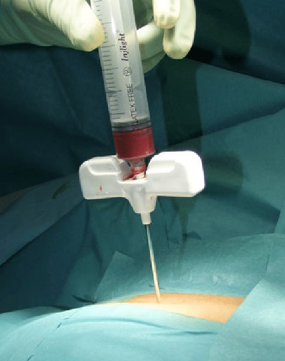{fig-align="center"}
:::
:::::

## Imaging studies

 

::::: columns
::: {.column width="50%"}
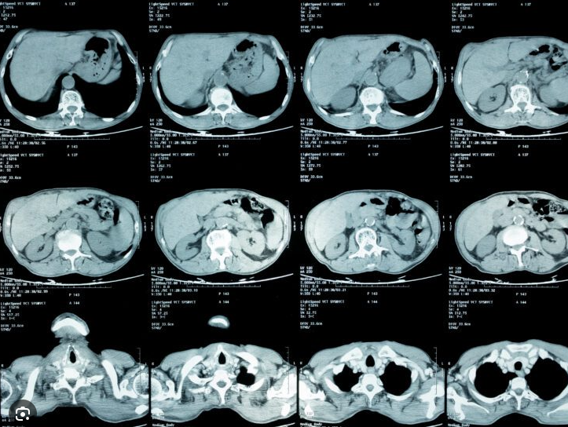
:::

::: {.column width="50%"}
**Generally low diagnostic yield without localizing symptoms**

-   CT of abdomen and chest

-   Ultrasound of gallbladder and hepatobiliary systems

-   CT pulmonary angiogram (for pulmonary embolis)

-   MRI for CNS, spleen, lymph nodes, aorta (vasculitis)

-   Indium 111-tagged white blood cell scan (becoming less common)

-   Gallium-67 scan (largely replaced by PET-CT)

-   **PET-CT:** Superior sensitivity for inflammatory and malignant processes
:::
:::::

## ¹⁸F-fluorodeoxyglucose (FDG) positron emission tomography

 

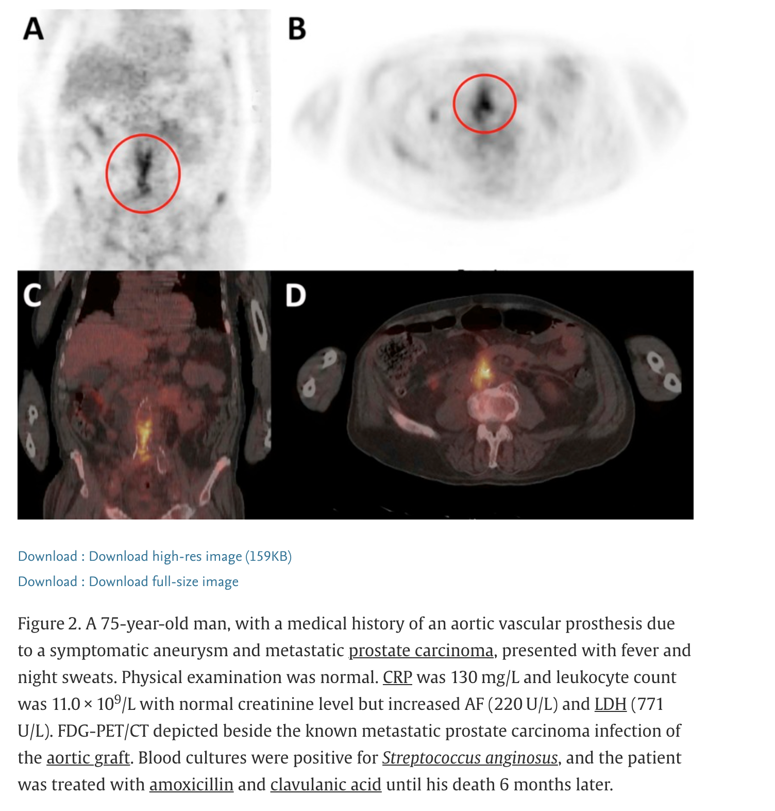{fig-align="center" width="600"}

::: aside
PET-CT has revolutionized the diagnostic approach to FUO. Overall sensitivities range from 86-98% and specificities from 52-85%, depending on the etiology. It is particularly useful for detecting focal sites of infection or inflammation that might be missed on conventional imaging.**Key clinical applications:** - Should be performed early in workup - Most helpful for: abscesses, osteomyelitis, vasculitis, adult-onset Still disease, Crohn disease, subacute thyroiditis - Can identify sites for targeted biopsy

[@kouijzer_etal18]
:::

## Invasive diagnostic procedures

 

-   **Biopsy techniques:**
    -   Excisional biopsy (lymph node)
    -   Needle biopsy (liver, kidney, muscle)
    -   Laparotomy or laparoscopy for direct visualization
-   **Diagnostic yield:**
    -   Biopsy yields diagnosis in \< 50% of cases
    -   Average 2-3 biopsies needed to establish diagnosis
-   **Indications:**
    -   Abnormal imaging or physical exam findings
    -   Lymphadenopathy suitable for lymph node biopsy
    -   Suspected granulomatous disease
    -   Persistent fever despite extensive workup

## Treatment Section {background-image="/images/thermometer.jpg" background-opacity="0.2"}

 

 

**A fundamental principle in classic FUO:**     Therapy should be withheld until the cause of fever is determined

::: aside
This is easier said than done in clinical practice, but the principle remains sound. Non-specific treatment with antipyretics, antibiotics, or corticosteroids rarely "cures" FUO and often delays the correct diagnosis, leading to prolonged suffering and inappropriate therapy.
:::

## Diagnostic summary and approach

{fig-align="center" width="800"}

::: aside
[@wright_auwaerter20]
:::

## When is immediate treatment indicated?

 

::: incremental
-   **Suspected temporal arteritis**
    -   Empirical corticosteroids to prevent vascular complications (blindness, stroke)
    -   Do not wait for biopsy confirmation if clinical suspicion high
-   **Febrile neutropenia or severe immunocompromise**
    -   High prevalence of serious bacterial infections
    -   Broad-spectrum antimicrobial therapy with anti-pseudomonas coverage after appropriate cultures obtained
    -   No delay for culture results
-   **Select cases with strong clinical suspicion:**
    -   Anti-mycobacterial therapy in suspected TB (especially if respiratory symptoms)
    -   Targeted therapy based on epidemiology and presentation
:::

::: notes
These exceptions to the "do not treat before diagnosis" rule are important. Temporal arteritis is a true medical emergency where delaying treatment risks permanent vision loss. Similarly, in neutropenic patients, the high mortality of untreated bacteremia necessitates empiric therapy. In contrast, empiric antibiotics in immunocompetent patients with FUO are generally unhelpful.
:::

## Prognosis

 

::: incremental
-   **Determined by:** The underlying cause of fever and nature of underlying disease(s)

-   **Poor prognosis:** Elderly patients with malignant neoplasms

-   **Diagnostic delay worsens prognosis in:**

    -   Intra-abdominal infections (perforation, sepsis)
    -   Miliary tuberculosis
    -   Disseminated fungal infections
    -   Recurrent pulmonary emboli

-   **Favorable outlook:** Patients with undiagnosed FUO after extensive evaluation

    -   Most experience resolution of fever within 4 weeks without sequelae
    -   **5-year mortality rate: 3.2%** for undiagnosed FUO
    -   Superior to patients with diagnosed malignancy as the underlying cause
:::

::: notes
This prognosis for undiagnosed FUO is reassuring and often not communicated to patients. Many are left feeling that an undiagnosed fever indicates a serious overlooked condition, when in fact the natural history suggests spontaneous resolution in most cases. Of course, continued surveillance is appropriate.
:::

## References
